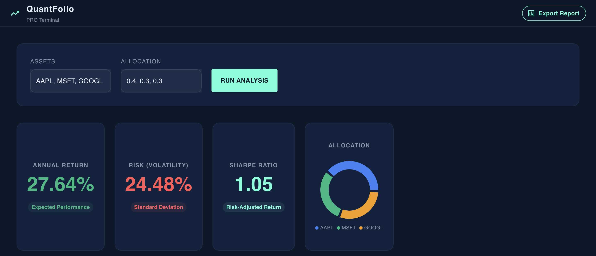
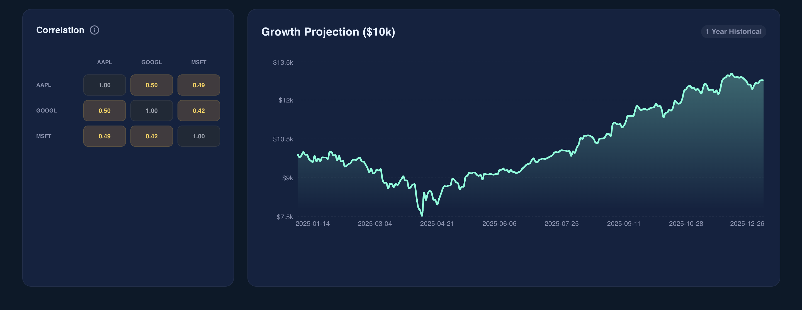

# QuantFolio: AI-Powered Portfolio Risk Engine 🚀


## 📋 Overview
QuantFolio is a quantitative financial analysis engine designed to help investors optimize their portfolios. Unlike simple stock trackers, this system uses **Modern Portfolio Theory (MPT)** and statistical analysis to calculate risk-adjusted returns (Sharpe Ratio), volatility, and asset correlations in real-time.

It features a high-performance **FastAPI** backend for mathematical modeling and a responsive **React** dashboard with a "Glassmorphism" dark UI for data visualization.

## ✨ Key Features
* **Mathematical Engine:** Vectorized calculation of Covariance Matrix, Standard Deviation, and Annualized Returns using `NumPy` & `Pandas`.
* **Risk Analysis:** Real-time computation of **Sharpe Ratio** to evaluate risk-vs-reward efficiency.
* **Correlation Heatmap:** Interactive matrix visualizing asset dependency (Pearson correlation) to aid in diversification.
* **AI Growth Projection:** Machine Learning model using **Linear Regression** to forecast portfolio growth for the next 30 days.
* **Growth Projection:** Time-series forecasting simulating "Growth of $10k" based on historical performance.
* **Senior-Level UI:** Professional Dark Mode dashboard using `Material UI` and `Recharts` with responsive grid layouts.

## 🛠 Tech Stack
### **Backend (The Brain)**
* **Language:** Python 3.9+
* **Framework:** FastAPI (Async/Await architecture)
* **Data Science:** NumPy (Matrix Math), Pandas (Time-series), Scikit-learn (Machine Learning)
* **Data Source:** Yahoo Finance API (`yfinance`)

### **Frontend (The Face)**
* **Library:** React.js (Hooks & Context API)
* **UI Framework:** Material UI (MUI v5)
* **Visualization:** Recharts (D3-based charting)
* **State Management:** Axios for API consumption

## 🚀 How to Run Locally

### 1. Clone the Repository
```bash
git clone https://github.com/Sankar-0326/QuantFolio-Project.git
cd quantfolio
```

### 2. Backend Setup
Navigate to the backend folder and set up the Python environment:

```bash
cd backend

# Create virtual environment
python3 -m venv venv

# Activate virtual environment
source venv/bin/activate  # (On Windows use: venv\Scripts\activate)

# Install dependencies
pip install -r requirements.txt

# Start the API server
uvicorn main:app --reload
```

### 3. Frontend Setup
Open a new terminal, navigate to the frontend folder, and launch the dashboard:

```bash
cd frontend

# Install Node.js dependencies
npm install

# Start the React development server
npm start
```

## 📸 Screenshots
*
*

## After Predictive - AI
**

## 🧠 The Math Behind It
The core logic relies on the **Sharpe Ratio** formula to measure risk-adjusted return:

$$\text{Sharpe Ratio} = \frac{R_p - R_f}{\sigma_p}$$

Where:
* $R_p$ = Expected Portfolio Return
* $R_f$ = Risk-Free Rate (assumed 2%)
* $\sigma_p$ = Portfolio Standard Deviation (Volatility)

